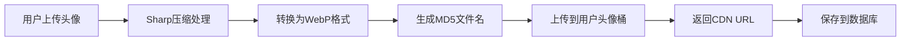
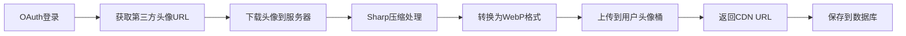
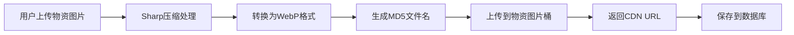

# 双COS桶配置说明

## 📦 架构设计

本项目采用**双COS桶架构**，实现用户头像和物资图片的分离存储：

### 1. 用户头像桶（共享用户体系）

**用途**：存储所有用户的头像数据

**特点**：
- ✅ **跨项目共享** - 多个项目使用同一用户体系，头像统一存储
- ✅ **独立管理** - 用户体系相关的资源集中管理
- ✅ **权限隔离** - 可以单独配置访问权限和生命周期

**存储内容**：
- 用户上传的头像
- OAuth（微信/QQ）获取的第三方头像

**目录结构**：
```
User/
  └── Avatars/
      ├── user_abc123_1234567890.webp
      ├── user_def456_1234567891.webp
      └── ...
```

### 2. 物资图片桶（项目专用）

**用途**：存储本项目的物资预览图

**特点**：
- ✅ **项目独立** - 每个项目使用独立的存储空间
- ✅ **数据隔离** - 项目之间数据完全隔离
- ✅ **灵活扩展** - 可以根据项目需要独立扩展

**存储内容**：
- 物资的预览图片

**目录结构**：
```
Materials/
  └── Images/
      ├── material_xyz789_1234567892.webp
      ├── material_uvw012_1234567893.webp
      └── ...
```

## 🔧 环境变量配置

在 `backend/.env` 文件中添加以下配置：

```env
# ========================================
# 腾讯云 COS 通用配置
# ========================================
# 所有桶共用的访问密钥
COS_SECRET_ID=your_cos_secret_id
COS_SECRET_KEY=your_cos_secret_key

# ========================================
# 用户头像 COS 配置（共享用户体系专用）
# ========================================
COS_USER_AVATAR_BUCKET=potatofield-user-avatars
COS_USER_AVATAR_REGION=ap-guangzhou
COS_USER_AVATAR_CDN_BASE_URL=https://user-avatars-cdn.example.com/

# ========================================
# 物资图片 COS 配置（本项目专用）
# ========================================
COS_MATERIAL_BUCKET=inventory-master-materials
COS_MATERIAL_REGION=ap-guangzhou
COS_MATERIAL_CDN_BASE_URL=https://materials-cdn.example.com/

# ========================================
# 兼容旧版本配置（可选）
# ========================================
# 如果没有配置上面的分桶参数，会使用这些作为默认值
COS_BUCKET=inventory-master-materials
COS_REGION=ap-guangzhou
```

### 配置说明

| 参数 | 说明 | 示例 |
|-----|------|------|
| `COS_SECRET_ID` | 腾讯云访问密钥ID | `AKIDxxxxxxxxxxxxxxxx` |
| `COS_SECRET_KEY` | 腾讯云访问密钥Key | `xxxxxxxxxxxxxxxx` |
| `COS_USER_AVATAR_BUCKET` | 用户头像存储桶名称 | `potatofield-user-avatars` |
| `COS_USER_AVATAR_REGION` | 用户头像存储桶地域 | `ap-guangzhou` |
| `COS_USER_AVATAR_CDN_BASE_URL` | 用户头像CDN域名（可选） | `https://user-cdn.example.com/` |
| `COS_MATERIAL_BUCKET` | 物资图片存储桶名称 | `inventory-master-materials` |
| `COS_MATERIAL_REGION` | 物资图片存储桶地域 | `ap-guangzhou` |
| `COS_MATERIAL_CDN_BASE_URL` | 物资图片CDN域名（可选） | `https://material-cdn.example.com/` |

### CDN配置

如果没有配置 `CDN_BASE_URL`，系统会自动使用默认的COS访问URL：
```
https://{BUCKET}.cos.{REGION}.myqcloud.com/
```

建议配置CDN域名以获得更好的访问速度。

## 💻 代码使用示例

### 1. 上传用户头像

```typescript
import { uploadToCos } from '../services/cosService';

// 上传到用户头像桶
const avatarUrl = await uploadToCos({
  buffer: imageBuffer,
  key: 'User/Avatars/user_abc123_1234567890.webp',
  contentType: 'image/webp',
  bucket: 'user', // 指定使用用户头像桶
});
```

### 2. 上传物资图片

```typescript
import { uploadToCos } from '../services/cosService';

// 上传到物资图片桶
const photoUrl = await uploadToCos({
  buffer: imageBuffer,
  key: 'Materials/Images/material_xyz789.webp',
  contentType: 'image/webp',
  bucket: 'material', // 指定使用物资图片桶
});
```

### 3. 删除文件

```typescript
import { deleteFromCos } from '../services/cosService';

// 删除用户头像
await deleteFromCos({
  url: 'https://user-cdn.example.com/User/Avatars/user_abc123.webp',
  bucket: 'user',
});

// 删除物资图片
await deleteFromCos({
  url: 'https://material-cdn.example.com/Materials/Images/material_xyz789.webp',
  bucket: 'material',
});
```

## 🔄 数据流程

### 用户头像上传流程



### OAuth头像处理流程



### 物资图片上传流程



## 📁 文件命名规则

### 用户头像

**格式**：`User/Avatars/user_{MD5}_{timestamp}.webp`

**示例**：`User/Avatars/user_5d41402abc4b2a76b9719d911017c592_1701234567890.webp`

**说明**：
- `user_` - 固定前缀
- `{MD5}` - 用户ID的MD5哈希值（32位）
- `{timestamp}` - 当前时间戳（毫秒）
- `.webp` - WebP格式

### 物资图片

**格式**：`Materials/Images/material_{MD5}.webp`

**示例**：`Materials/Images/material_e4da3b7fbbce2345d7772b0674a318d5.webp`

**说明**：
- `material_` - 固定前缀
- `{MD5}` - `userId_timestamp` 的MD5哈希值
- `.webp` - WebP格式

## 🎯 图片处理规格

### 用户头像

- **尺寸**：640x640 像素
- **格式**：WebP
- **质量**：80%
- **裁剪**：cover（保持比例，填充满）

### 物资图片

- **最大尺寸**：1920x1920 像素
- **格式**：WebP
- **质量**：80%
- **保持比例**：是

## 🛡️ 安全性

### 访问控制

1. **私有读取** - 建议设置桶为私有读取，通过CDN访问
2. **防盗链** - 在CDN层配置防盗链
3. **访问密钥** - 定期轮换 COS 访问密钥

### 文件验证

1. **文件类型** - 仅允许图片格式（通过 multer 过滤）
2. **文件大小** - 限制最大 5MB
3. **图片验证** - 使用 sharp 验证是否为有效图片

## 📊 存储成本优化

### 生命周期管理

建议在COS控制台配置生命周期规则：

**用户头像桶**：
- 保留所有文件（用户可能长期使用）

**物资图片桶**：
- 删除的物资图片可以在30天后自动清理（需要标记）

### CDN缓存

建议CDN缓存设置：
- 用户头像：7天
- 物资图片：7天

## 🔍 监控和日志

建议开启以下功能：

1. **访问日志** - 记录所有COS访问日志
2. **CDN日志** - 记录CDN访问日志
3. **告警规则** - 配置流量、请求数告警

## ❓ 常见问题

### Q: 为什么要使用双桶架构？

**A**: 
- **用户体系共享**：多个项目共用一套用户系统，头像统一存储避免重复
- **数据隔离**：项目专用数据独立存储，便于管理和权限控制
- **成本优化**：可以针对不同类型数据设置不同的存储策略
- **灵活扩展**：每个桶可以独立配置CDN、生命周期等

### Q: 如果只有一个桶怎么办？

**A**: 可以将用户头像桶和物资图片桶配置为同一个桶，系统会自动通过目录前缀区分。

### Q: CDN域名是否必须配置？

**A**: 不是必须的。如果不配置CDN域名，系统会使用默认的COS访问URL，但建议配置CDN以获得更好的访问速度。

### Q: 如何迁移现有数据？

**A**: 
1. 使用COS批量复制工具迁移文件
2. 更新数据库中的URL字段
3. 验证新URL可访问
4. 清理旧桶中的文件

## 📝 总结

双COS桶架构为项目提供了：

✅ **清晰的数据隔离** - 用户数据和项目数据分离  
✅ **灵活的权限管理** - 不同桶可以配置不同的访问策略  
✅ **优化的成本控制** - 针对不同数据类型设置不同的存储策略  
✅ **便捷的扩展能力** - 新项目可以快速接入共享用户体系  

这种架构设计既保证了数据的安全性，又提供了良好的扩展性。
